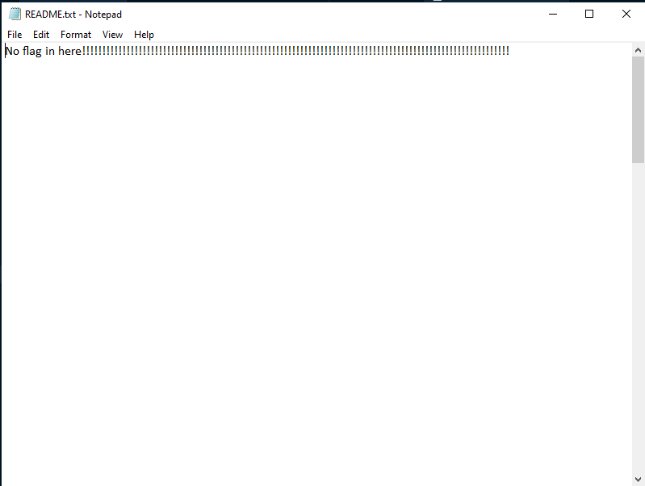
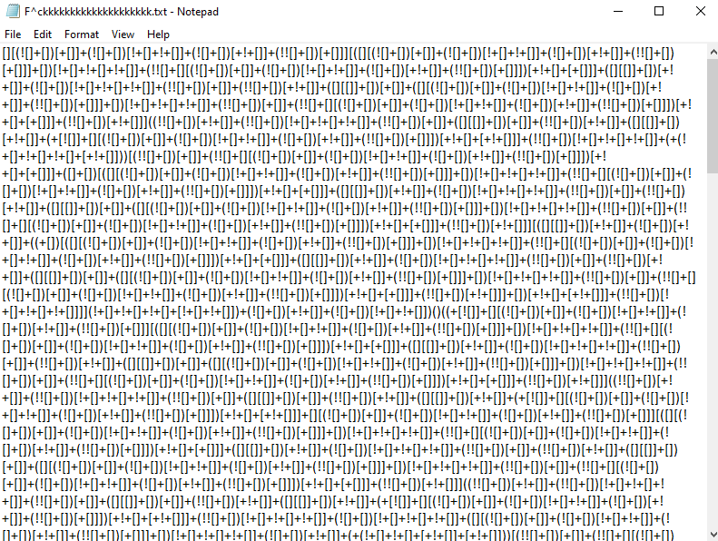

# Kakuremino no Jutsu - Misc
## Description
> Kakuremino no Jutsu là một thuật cơ bản nhưng nó rất hữu ích trong việc làm các nhiệm vụ theo dõi, trinh sát hay cả trong chiến đấu,...Hãy làm một bài test nho nhỏ về nhẫn thuật này.                                                                                                                                                                  
[Challenge](img/Challenge.rar)
## Solution
- Giải nén file được cung cấp ta nhận được 1 file txt kèm với đó là 1 bức ảnh 
- Trước hết ta mở file txt                                                      

- Tưởng chừng như không có gì trong file txt này nhưng dưới cuối file có 1 hint nhỏ

- Change scroll -> file ảnh tên Scroll -> change file scroll. Ta sẽ thử thay đổi phần file name extension của file ảnh sang rar và đúng là ta nhận được 1 file rar có thể sử dụng.
- Giải nén ra ta lại nhận được 2 file tương tự ban đầu. Nhưng lần này sau khi chuyển định dạng ảnh sang rar ta không thể giải nén ngay mà nó yêu cầu mật khẩu.
- File hint cho ta gợi ý về password:
>What is the name of the mountain containing this scroll?

- Password là tên ngọn núi có liên quan đến bức ảnh đi kèm. Bằng chút kiến thức về Naruto ta tìm ra được đó là núi MYOBOKU.
> Ta cũng có thể dùng google hình ảnh để tìm bức ảnh đi kèm và từ đó tìm ra từ khóa về núi MYOBOKU

- Giải nén với pass MYOBOKU lần này là 1 file txt và 1 folder ảnh luôn.
- Thử xem [file txt](img/F^ckkkkkkkkkkkkkkkkkkkk.txt) -> 1 đống ký tự khó hiểu

- Tên file: F^ckkkk... + sử dụng https://www.dcode.fr/cipher-identifier ta có thể biết được đống ký tự đó là JSFuck Language.
- Decode với https://enkhee-osiris.github.io/Decoder-JSFuck/ ta nhận được hint 
> The flag is planted on the ground but it flies in the sky
 - "Flag flies in the sky" là mấu chốt để tìm ra bức ảnh chứa flag.
 - Với từ khóa "sky" ta có thể liên hệ được đến bức ảnh                                                           
 
 > Chữ Nhật trong bức ảnh khi dịch sang tiếng Việt là "thiên" và tiếng Anh là "sky"

- Làm tương tự như những bước trước ta giải nén với pass SKY và nhận được [flag](img/flag.txt)
- Flag: ISPCLUB{h1d3_f1l3_1n_p1ctur3}