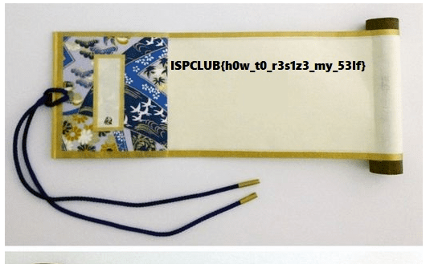
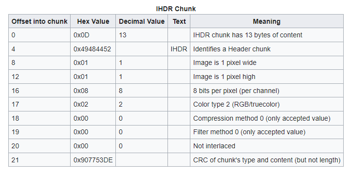
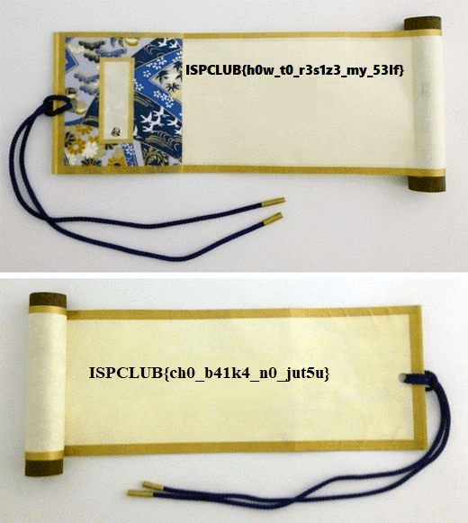

# Baika - Forensic
## Description
> Jicho - một người trong nhóm bạn của bạn, là 1 thành viên thuộc tộc Akimochi của PTITgakure. Jicho nói rằng người trong tộc Akimochi chỉ có thể sử dụng được thuật thay đổi kích thước cơ thể. Liệu có bí thuật nào có thể tháy đổi kích thước vật thể không ?
> 
> [Baika](img/2.png)
## Solution
- Đề cho một hình ảnh:                                        

- Và dĩ nhiên flag hiện ra ngay trong ảnh là flag fake.
- Nhìn kỹ xuống mép dưới của ảnh ta có thể đoán được ảnh bị chỉnh kích thước nên không thể hiển thị hết.
- Sử dụng HXD cùng với kiến thức về IHDR chunk có thể dễ dàng chỉnh lại kích thước của ảnh:

- Flag xuất hiện sau khi ảnh được chỉnh:                                 

- Flag: ISPCLUB{ch0_b41k4_n0_jut5u}

