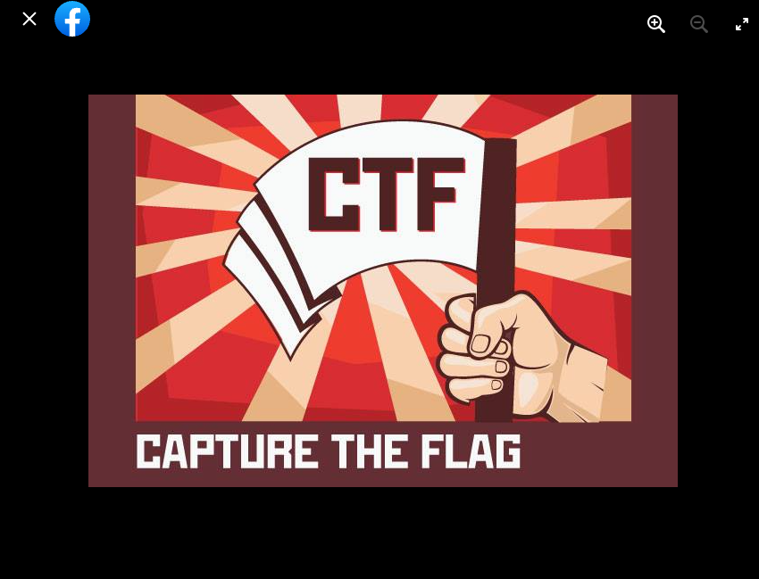

# First Generation - Misc
## Description
> Trải qua nhiều thế hệ, biểu tượng của ISP Ichizoku đã được thay đổi rât nhiều nhưng biểu tượng thời sơ khai vẫn được cất giữ cẩn thận trong phòng truyền thống của gia tộc. Trên đó có 1 secret text. Chắc bạn sẽ tìm được nó nhanh thôi.                                                                                                     
Flag form: ISPCLUB{SECRET_TEXT}

## Solution
- Nói đến biểu tượng của ISP Ichizoku thì chỉ có thể là ảnh đại diện trên fanpage của [CLB ISP](https://www.facebook.com/ATTT.PTIT)
- Biểu tượng thời sơ khai hay nói cách khác là ảnh đại diện đầu tiên trên fanpage của CLB ISP.
- Truy cập album ảnh đại diện và tìm bức ảnh đầu tiên

- Flag: ISPCLUB{CAPTURE_THE_FLAG}
