# Himitsu No Ninmu - General Skill
> Đây là một challenge bao gồm một chuỗi các câu đố, tập trung vào khả năng suy luận logic và kỹ năng tìm kiếm bằng Google.
- Truy cập thử link pastebin sẽ thấy câu đố đầu tiên:
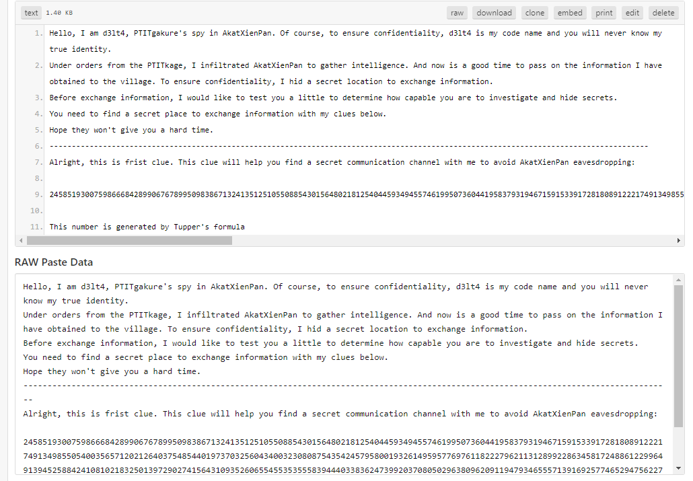
- Trong câu hỏi có nhắc đến:
> This number is generated by Tupper's formula
- Google nhanh Tupper's formula sẽ thấy đây là 1 công thức biểu diễn trực quan trên 1 vị trí cụ thể trong một mặt phẳng
- Đồng thời, cũng có thể thấy 1 tool online hỗ trợ tính toán và biểu diễn công thức này:
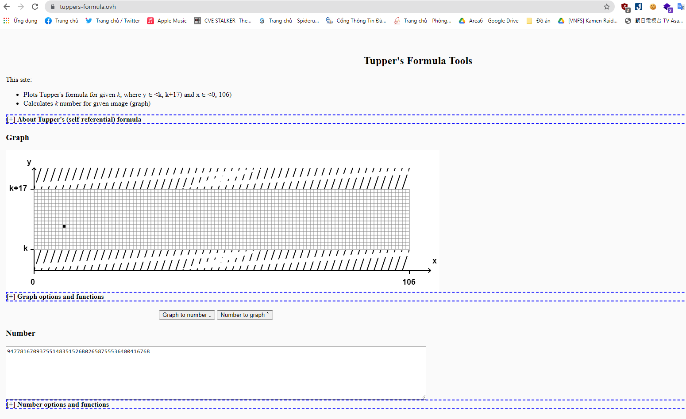
- Sử dụng công cụ trên để biểu diễn số đã cho:
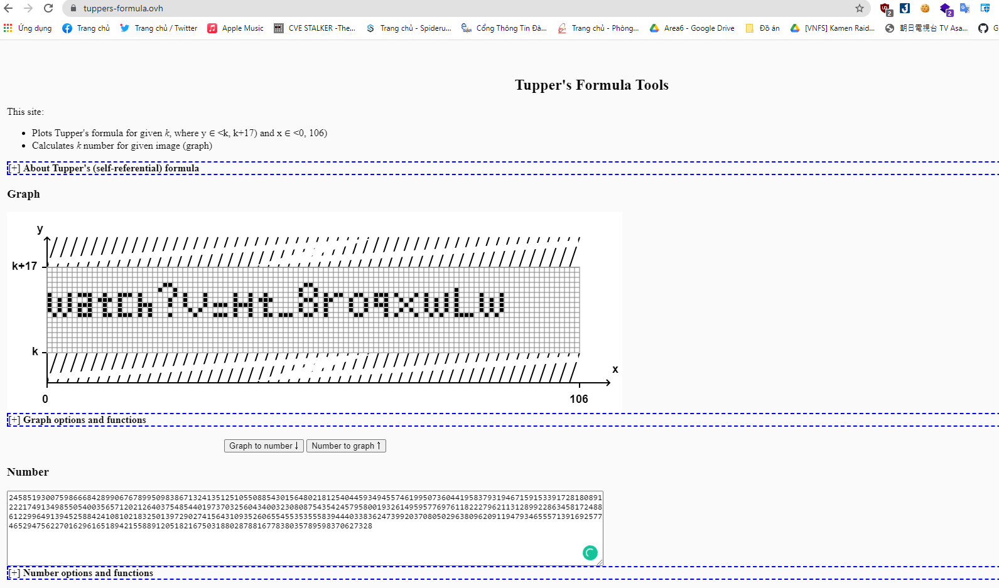
- Có thể thấy đây là 1 link youtube với path /watch quen thuộc. Đi đến link youtube: https://www.youtube.com/watch?v=Ht_8roqxwLw
- Tại giây thứ 8 trong video có thể thấy có 1 hình ảnh hiện lên rất nhanh. Giảm tốc độ phát của video và dễ dàng lấy được hình ảnh đó:
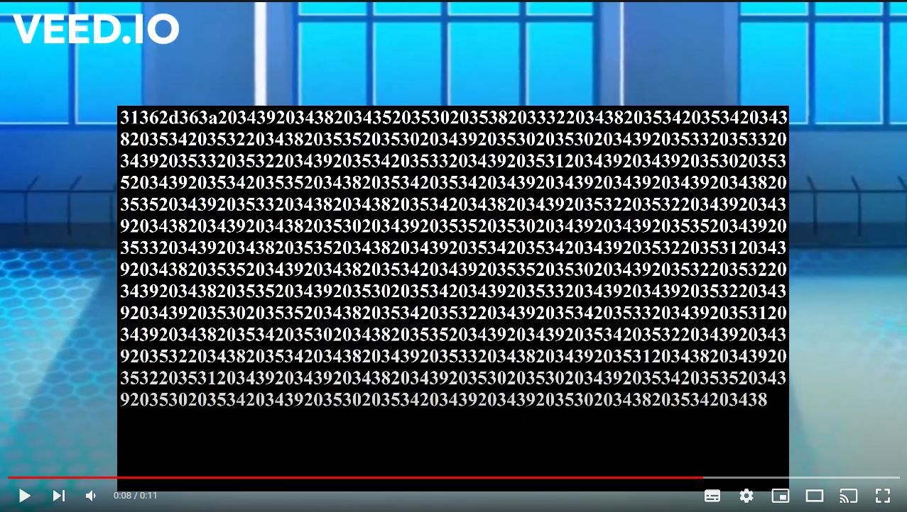
- Sử dụng các công cụ crop string từ image có sẵn trên internet sẽ dễ dàng lấy được string này:
> 31362d363a203439203438203435203530203538203332203438203534203534203438203534203532203438203535203530203439203530203530203439203533203533203439203533203532203439203534203533203439203531203439203439203530203535203439203534203535203438203534203534203439203439203439203439203438203535203439203533203438203438203534203438203439203532203532203439203439203438203439203438203530203439203535203530203439203439203535203439203533203439203438203535203438203439203534203534203439203532203531203439203438203535203439203438203534203439203535203530203439203532203532203439203438203535203439203530203534203439203533203439203439203532203439203439203530203535203438203534203532203439203534203533203439203531203439203438203534203530203438203535203439203439203534203532203439203439203532203438203534203438203439203533203438203439203531203438203439203532203531203439203439203438203439203530203530203439203534203535203439203530203534203439203530203534203439203439203530203438203534203438
- Dựa vào số ký tự xuất hiện trong string, có thể nhận thấy đây là 1 string được encode bằng hệ thập lục phân (hex). Sử dụng trang web [kt.gy]() để decode:
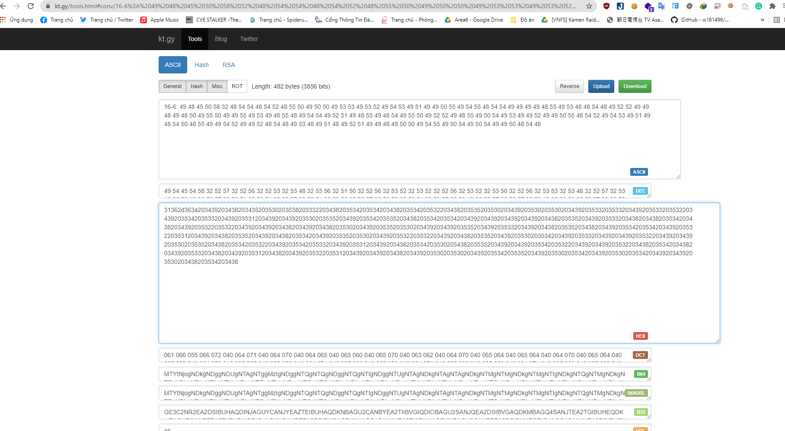
- Sau khi decode hex sẽ thấy gợi ý tiếp theo là 16-6 => string được encode bằng hệ thập phân (dec). Tiếp tục decode dec:
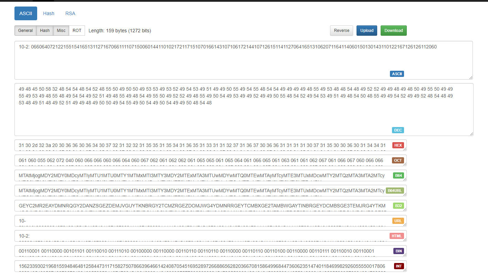
- Gợi ý tiếp theo là 10-2 => string được encode bằng hệ bát phân (oct). Decode oct:
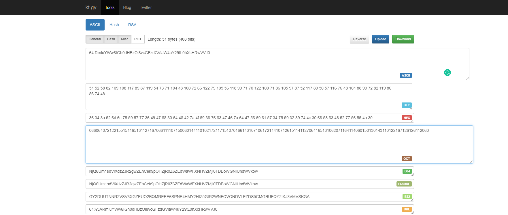
- Gợi ý tiếp theo là 64 => string được encode bằng base64. Decode base64:
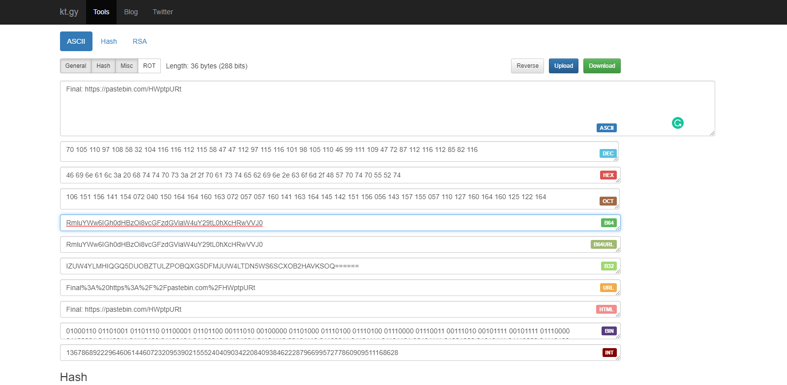
- Sau khi decode đước string, các bạn sẽ thu được link pastebin: [https://pastebin.com/HWptpURt](https://pastebin.com/HWptpURt)
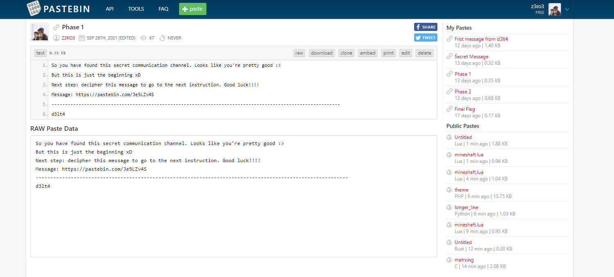
- Câu đố tiếp theo sẽ yêu cầu giải mã thông điệp tại [https://pastebin.com/Je5LZv4S](https://pastebin.com/Je5LZv4S)
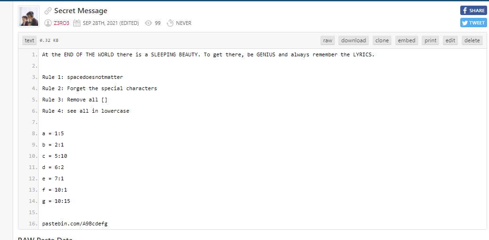
- Có thể thấy link pastebin ở cuối có dạng A9Bcdefg và thông điệp cho manh mối về các chữ a, b, c, d, e, f, g => Chúng ta cần tìm những chữ cái tại các vị trí a, b, c, d, e, f, g và thay vào link pastebin
- Dựa vào những manh mối được viết hoa, thử google với từ khóa END OF THE WORLD SLEEPING BEAUTY GENIUS LYRICS
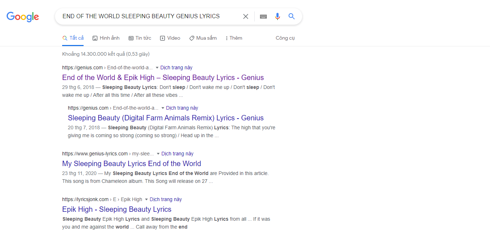
- Có thể thấy kết quả đầu tiên là lyrics bài hát Sleeping Beauty của nhóm End of the World tại trang web cung cấp lời bát hát genius.com
- Kết hợp cùng với các rule cho sẵn và hint dòng:chữ, có thể đoán tại mỗi vị trí a, b, c, d, e, f, g sẽ là 1 chữ cái trong lời bài hát này
- Thực hiện các rule đã cho: xóa dấu cách, xóa các ký tự đặc biệt, xóa các dòng có [] và viết thường toàn bộ chữ cái:
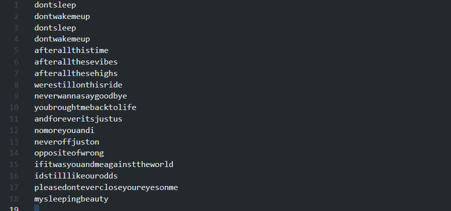
- Tìm kiếm các chữ theo thứ tự ta sẽ thu được:
> a = 1:5 = chữ thứ 5 tại dòng 1 = s  
>b = 2:1 = chữ thứ 1 tại dòng 2 =d   
>c = 5:10 = chữ thứ 10 tại dòng 5 = h   
>d = 6:2 = chữ thứ 2 tại dòng 6 = f   
>e = 7:1 = chữ thứ 1 tại dòng 7 = a   
>f = 10:1 = chữ thứ 1 tại dòng 10 = y   
> g = 10:15 = chữ thứ 15 tại dòng 10 = c
- Từ đó có được link pastebin cần tìm: [https://pastebin.com/S9Dhfayc](https://pastebin.com/S9Dhfayc)
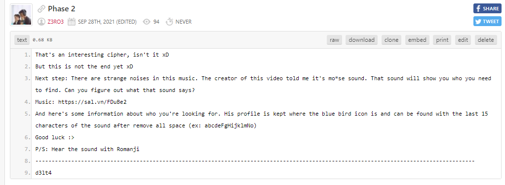
- Câu đố tiếp theo yêu cầu tìm ra thông điệp của 1 tiếng ồn trong 1 file nhạc. Tiếng ồn đó được gợi ý là mo*se sound
- Nghe file nhạc sẽ thấy rằng tại phút 6:24 sẽ có 1 đoạn tiếng ồn nhẹ
- Google các từ khóa như là mose sound sẽ có thể google gợi ý đến morse sound:
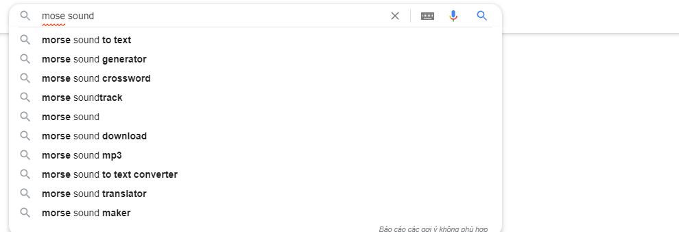
- Morse code là là một loại mã hóa ký tự dùng trong viễn thông để truyền các thông tin điện báo
- Như vậy câu đố yêu cầu thực hiện giải mã đoạn morse trong file nhạc
- Đến đây chắc hẳn nhiều bạn sẽ cố gắng thực hiện tách đoạn morse đó ra và giải mã nhưng mình tin rằng sẽ không có nhiều bạn sẽ giải mã được đoạn morse code này xD.
- Hãy nhớ rằng đây là 1 chall mình thiết kế để các bạn có thể google được :>
- Google với từ khóa: Is There Still Anything That Love Can Do-RADWIMPS morse sound. Các bạn sẽ bắt gặp 1 link reddit đã viết về vấn đề này:
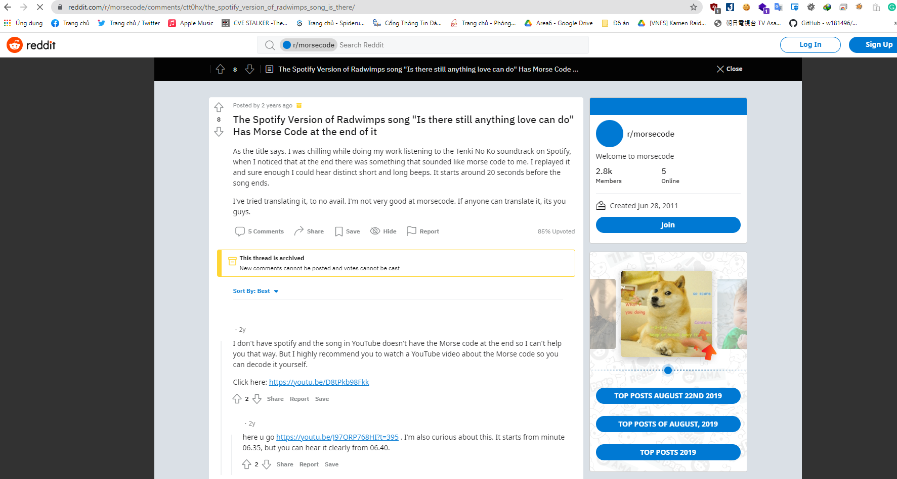
- Reddit là một mạng xã hội tương tự facebook. Ở đây có rất nhiều vấn đề khác nhau được cộng đồng mang ra mổ xẻ. Và tất nhiên vấn đề các bạn đang thắc mắc cũng không ngoại lệ:
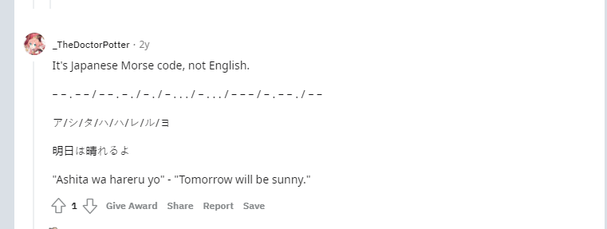
- Đây chính là lý do các bạn không thể giải được đoạn mã morse đó xD. Đơn giản bởi vì đây là mã morse sử dụng cho tiếng Nhật :>
- Sau khi giải mã được đoạn morse, các bạn sẽ thu được 1 chuỗi romanji: Ashita wa hareru yo
- Dựa vào các gợi ý trong câu đố, các bạn sẽ nhận ra ngay mình đang ám chỉ đến mạng xã hội Twitter với biểu tượng hình con chim xanh quen thuộc
- Profile twitter của một người có thể dễ dàng truy cập bằng đường dẫn: https://twitter.com/username
- Lấy 15 ký tự cuối của chuỗi romanji thu được từ mã morse theo đúng format abcdeFgHijklmNo, các bạn sẽ có được profile Twitter cần tìm: https://twitter.com/shitaWaHareruYo
- Khi truy cập đến profile Twitter, các bạn sẽ bắt gặp câu đố tiếp theo:
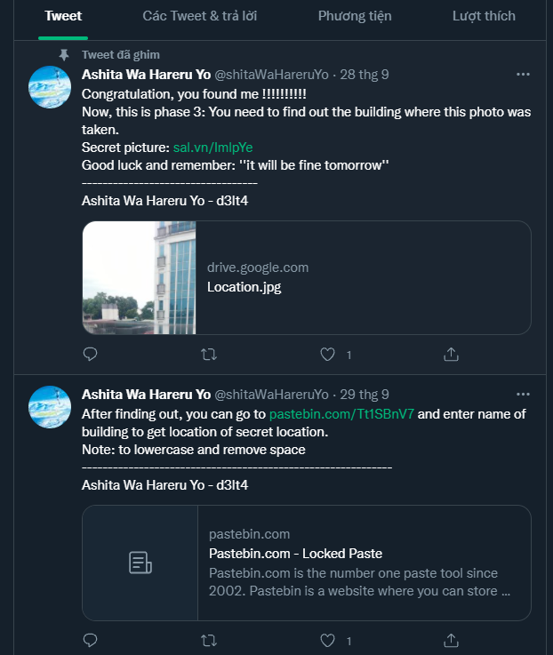
- Câu đố này yêu cầu tìm ra địa điểm chụp một bức ảnh
- Tiếp tục google với keyword: find location of photos
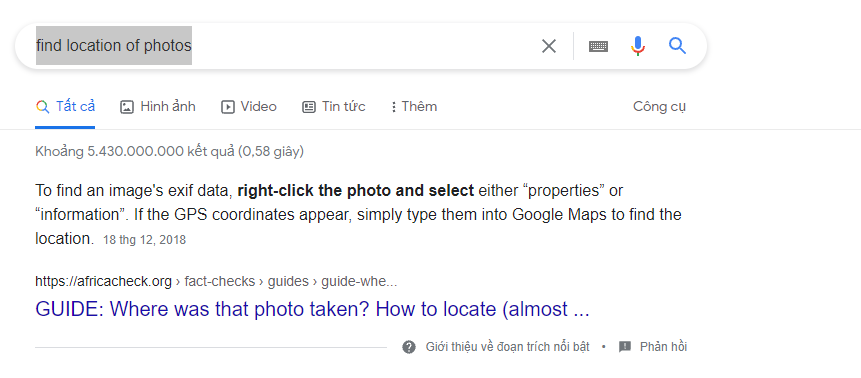
- Các bạn sẽ thấy ngay một hướng dẫn lấy được gps vị trí chụp bức ảnh thông qua exif data
- Exif là viết tắt của Exchangeable Image File Format, là một tiêu chuẩn để xác định thông tin liên quan đến một bức ảnh được tạo bởi một thiết bị ghi hình cụ thể, các thông số phơi sáng của máy ảnh, tiêu cự, cân bằng trắng, ngày giờ việc ghi hình xảy ra, và cả vị trí GPS
- Thực hiện theo hướng dẫn tìm được hoặc sử dụng các công exif data vierwer có sẵn trên mạng, các bạn sẽ có thể lấy được thông tin gps vị trí chụp bức ảnh:
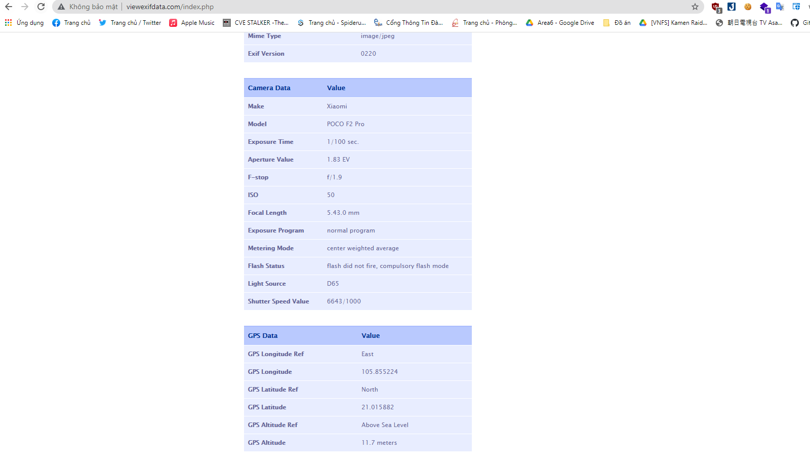
- Sử dụng google map để tìm vị trí theo vĩ độ và kinh độ gps:
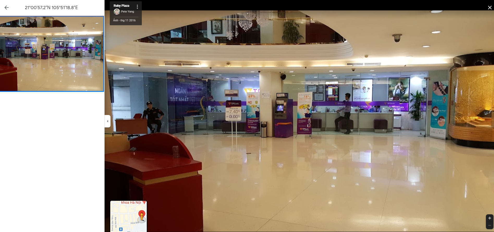
- Như vậy có thể thấy vị trí chụp bức ảnh này là tại Ruby Plaza
=> password để truy cập link pastebin https://pastebin.com/Tt1SBnV7 là rubyplaza:
- Truy cập vào link pastebin để lấy flag:

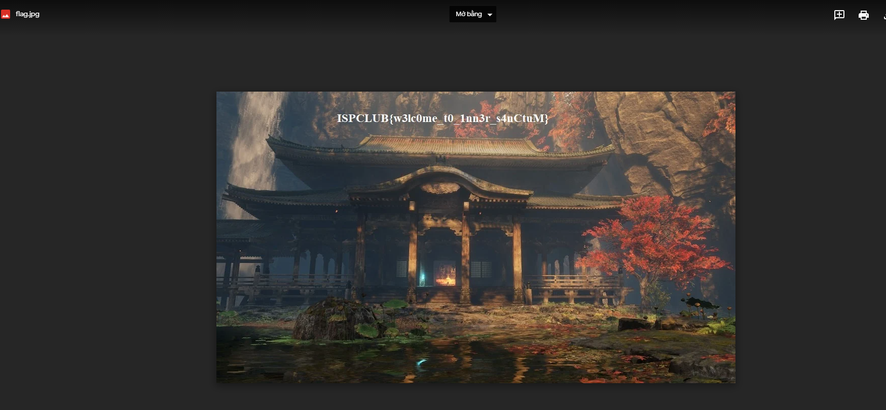
- Flag: ISPCLUB{w3lc0me_t0_1nn3r_s4nCtuM}
> Đó là toàn bộ lời giải của mình cho bài Himitsu no Ninmu. Hy vọng sẽ được gặp lại các bạn tại ISP trong buổi phỏng vấn tuyển thành viên mới :>
